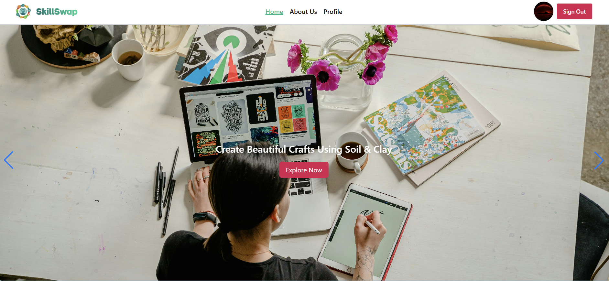

# 🔁 Skill Swap — Learn, Share & Grow Skills



---

## 🚀 Live Demo
🔗 https://b12-a9-skillswap.netlify.app

---

## 📌 Project Overview

**Skill Swap** is a modern skill-sharing platform where users can explore different skills, view detailed information, and manage their personal profiles.

The platform focuses on helping learners **discover, learn, and grow** through a clean UI, smooth interactions, and secure authentication using Firebase.

---

## 🎯 Purpose of the Project

The main goals of **Skill Swap** are:

- Help users discover new skills easily
- Provide detailed skill information
- Enable secure user authentication
- Allow users to manage their profiles
- Deliver a smooth and responsive UI experience

---

## ⭐ Key Features

### 🔹 Skill Cards
- Displays skills with image, price, rating, and title
- Each card includes a **View Details** button

### 🔹 Skill Details Page
- Shows full details of the selected skill
- Clean and readable layout

### 🔹 User Authentication
- Login & Registration
- Forgot Password
- Firebase Email & Password Authentication

### 🔹 User Profile
- View profile picture, name, and email
- Update profile information

### 🔹 UI / UX Enhancements
- Fully responsive (Mobile, Tablet, Desktop)
- Swiper slider on homepage
- Loading spinners
- Toast notifications
- Smooth animations with Animate.css

---

## 🛠️ Tech Stack

### Frontend
- React
- React Router
- Tailwind CSS
- DaisyUI
- Animate.css
- Swiper.js
- React Icons
- React Hot Toast

### Backend / Services
- Firebase Authentication
- Firebase Hosting (optional)

---

## 📦 NPM Packages Used

- `@tailwindcss/vite`
- `animate.css`
- `axios`
- `firebase`
- `react`
- `react-dom`
- `react-hot-toast`
- `react-icons`
- `react-router`
- `react-spinners`
- `swiper`
- `tailwindcss`

---

## 📄 Pages in the Application

- `Home.jsx` — Hero section, skill slider, featured skills
- `Skills.jsx` — All skill listings
- `SkillDetails.jsx` — Single skill details
- `Login.jsx`
- `Register.jsx`
- `Profile.jsx` — User profile management
- `Error404.jsx`

---

## 🧑‍💻 Getting Started

Follow these steps to run **Skill Swap** locally.

---

### ✅ Prerequisites

Make sure you have installed:
- Node.js (v18+ recommended)
- npm or yarn

---

### 🔧 Installation

```bash
git clone https://github.com/Jobayer561/B12-A09-SkillSwap.git
cd SkillSwap
npm install
npm run dev
